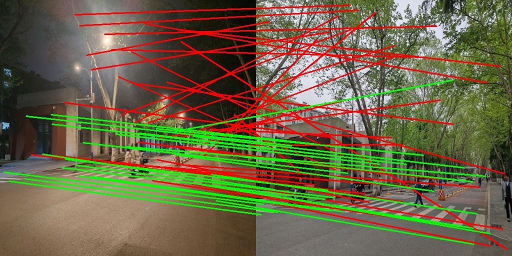
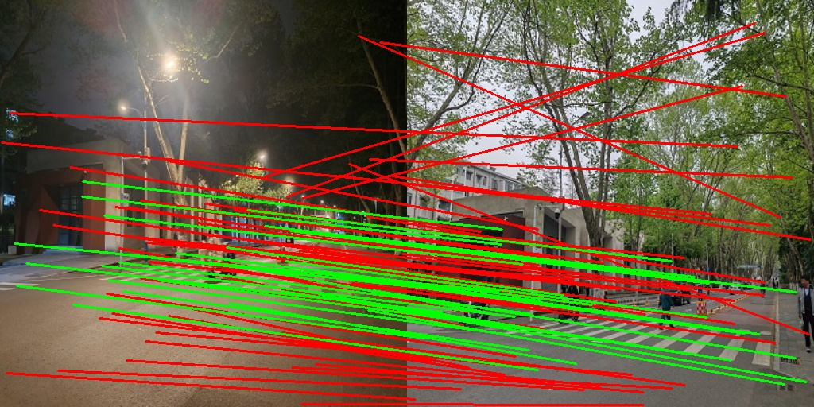
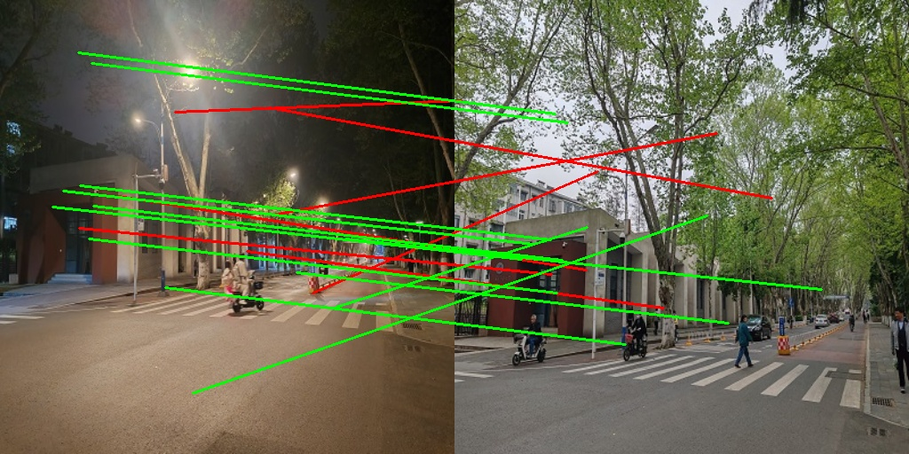
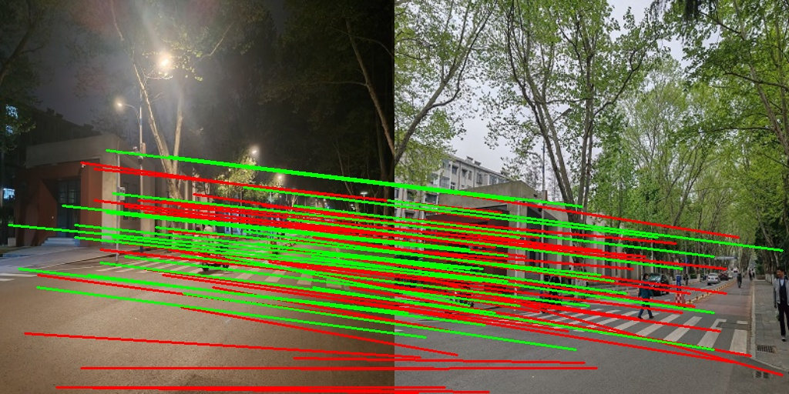
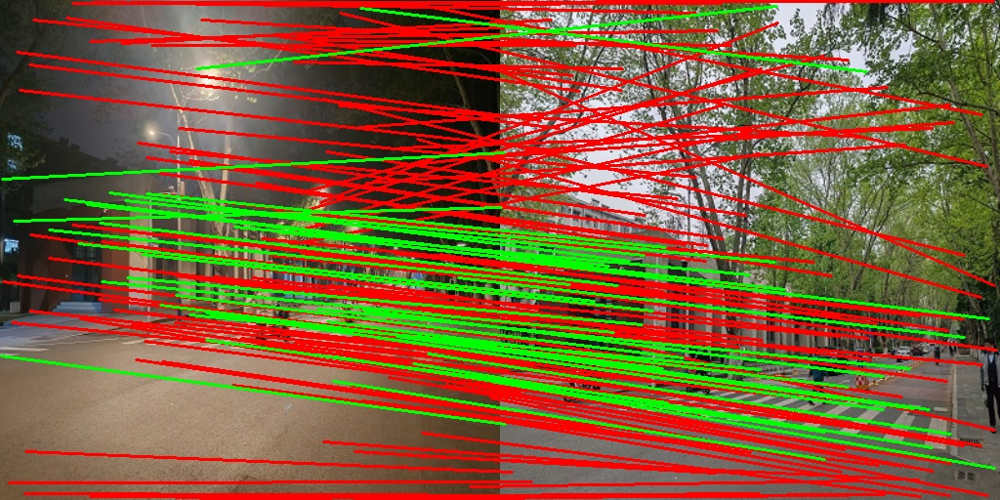

# learned_features_inference
Implementing c++ inference for various learning point features

## OpenVINO inference time
| SuperPoint | ALIKE-T   | D2Net      | DISK         | XFeat        |
|------------|-----------|------------|--------------|--------------|
| 28.166 ms  | 70.038 ms | 109.992 ms | 408.688 ms | 73.582 ms |

## TensorRT inference time
| SuperPoint | ALIKE-T   | D2Net      | DISK         | XFeat        |
|------------|-----------|------------|--------------|--------------|
| 8.217 ms  | 49.953 ms | 18.772 ms | 116.363 ms | 4.255 ms |

## Examples 

- SuperPoint

- ALIKE-T

- DISK

- D2Net

- XFeat

## Supported Features:
- [SuperPoint](https://github.com/magicleap/SuperPointPretrainedNetwork)
- [ALIKE-T](https://github.com/Shiaoming/ALIKE)
- [DISK](https://github.com/cvlab-epfl/disk)
- [D2Net](https://github.com/mihaidusmanu/d2-net)
- [XFeat](https://github.com/pfnet-research/xfeat)
- More TODO 

## Supported Libraries:
- [OpenVINO](https://docs.openvino.ai/2022.3/home.html) in openvino branch
- [NCNN](https://github.com/Tencent/ncnn) (TODO)
- [TensorRT](https://developer.nvidia.com/tensorrt) (TODO)
